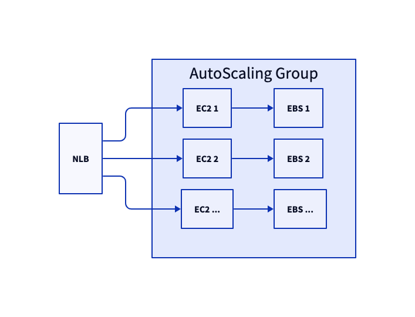

# AWS
This module will create a production-ready Observability Pipelines (OP) cluster in a specified VPC. This is inclusive of the necessary tools for disk buffers, load-balancing, and autoscaling, as seen below:



**A note on persistence:** This module does create EBS drives for disk buffers. However, since they are created by the AutoScaling Group, they will be destroyed during scale-down events or if the associated instance is terminated. This means that all buffered data will be lost during these events.

## Usage
To use this module, include it in your Terraform manifests like so:

```
module "opw" {
    source     = "https://github.com/DataDog/opw-terraform//aws"
    vpc-id     = "{VPC ID}"
    subnet-ids = ["{SUBNET ID 1}", "{SUBNET ID 2}"]
    region     = "{REGION}"

    datadog-api-key = "{DATADOG API KEY}"
    pipeline-id = "{OP PIPELINE ID}"
    pipeline-config = <<EOT
    # Substitute your configuration here, if you have one, or use this
    # as a starting point.
    sources:
    dd:
        type: datadog_agent
        address: 0.0.0.0:8282
        multiple_outputs: true
    sinks:
    dd_metrics:
        type: datadog_metrics
        inputs:
        - dd.metrics
        # The double-$ there is intentional- Terraform requires that these be
        # escaped so that DD_API_KEY isn't interpolated by its template
        # language.
        default_api_key: $${DD_API_KEY}
    EOT
}
```